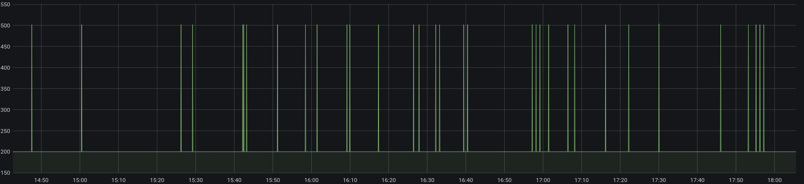

# gomonitor WORK IN PROGRESS
A tool written in Go to monitor different services easily.

## Introduction / What is this?

About 4 months ago in november 2020 I noticed a performance degradation on my website,
and some other services I often used. 

My monitoring setup at this time was small and external, hosted by some popular providers,
which had the problem of only monitoring specific things every 1/5 minutes. So finding the problem got pretty hard for me and led to a decision.

I needed a simple binary tool for my debian based infrastructure,
which can monitor services bases from a config file to my own influxdb and grafana backend (in fast intervals and non-blocking).

So about then I wrote a quick and dirty solution, which fitted my exact needs. 
Now I want to improve the tool for a short term, fast paced monitoring.

What I saw from my first non versioned tool was pretty interesting (see example images below):
 * I saw a cronjob killing a website performance every x minutes.
 * I saw interesting routing issues between my cluster based node structure.
 * I saw my own webpage flickering around between online and offline based on a load balancer issue.

I quickly noted that these are things, which can't be monitored when the check only runs every minute. 
I had issues where a site would appear offline (better returning a 500) when visited in the first 2 seconds of a minute, but afterwards was completely fine.


## Config file

The config file must be named "monitoring_config.json" and be readable in the same directory as the binary file.
For a full example of a valid-like config file see ```monitoring_config.example.json```

Note: indentation is not relevant, but keys/values are case-sensitive (must be a valid UTF-8 json file)

## Available monitoring types/protocols + examples
### Types:
* #### simplePortMonitor:
  ###### used for monitoring a specific protocol and port
    ```
    {
      "displayNameTarget": "target-tcp-port-1",
      "intervalInMilliseconds": 1000, // interval in milliseconds for independed check calls
      "timeoutInMilliseconds": 60000, // timeout in milliseconds if target needs longer to answer -> offline
      "type": "simplePortMonitor",
      "protocolName": "tcp", // one of the types "tcp, tcp4, tcp6, udp, udp4, udp6"
      "destination": "127.0.0.1", // either an IPv4 "1.2.3.4" or IPv6 "[abcd:efab::1]" 
      "port": 80 //port number of the service you want to check against
    }
    ```
  ###### output example
    ```
      measurement: simplePortMonitor
      tags: name, source (both from config file)
      fields:
        - isOnline (either 0 or 1) 1 == online, 0 == offline
        - responseTime (in milliseconds) e.g. 523 means 0,523 seconds
    ```

* #### simpleWebMonitor:
  ###### used for monitoring a specific web page
    ```
    {
      "displayNameTarget": "target-https-host-1",
      "intervalInMilliseconds": 1000, // interval in milliseconds for independed check calls
      "timeoutInMilliseconds": 60000, // timeout in milliseconds if target needs longer to answer -> offline
      "type": "simpleWebMonitor",
      "protocolName": "https", // one of the types "http, https"
      "destination": "127.0.0.1", // either an IPv4 "1.2.3.4" or IPv6 "[abcd:efab::1]" or Hostname: "www.example.com"
      "port": 443 //port number of the service you want to check against http -> 80, https -> 443
    }
    ```
  ###### output example
    ```
      measurement: simpleWebMonitor
      tags: name, source (both from config file)
      fields:
        - isOnline (either 0 or 1) 1 == online, 0 == offline
        - responseTime (in milliseconds) e.g. 523 means 0,523 seconds
        - statusCode e.g. 200 means HTTP OK, basic http response code we got
    ```
* #### simpleSSLMonitor:
  ###### used for monitoring a specific ssl certificate
    ```
    {
      "displayNameTarget": "target-ssl-host-1",
      "intervalInMilliseconds": 3600000, // interval in milliseconds for independed check calls
      "type": "simpleSSLMonitor",
      "protocolName": "tcp", // should always be "tcp"
      "destination": "127.0.0.1", // either an IPv4 "1.2.3.4" or IPv6 "[abcd:efab::1]" or Hostname: "www.example.com"
      "port": 443 // port number of the ssl service mostly https -> 443
    }
    ```
  ###### output example
    ```
      measurement: simpleSSLMonitor
      tags: name, source (both from config file)
      fields:
        - isOnline (either 0 or 1) 1 == online, 0 == offline (note: will be marked offline when certificate check fails)
        - commonName of first certificate in chain
        - timeSinceValid (in milliseconds) time since notBefore in cerificate was passed (can be 0 == invalid)
        - timeToExpire (in milliseconds) time till notAfter in certificate will be met (can be 0 == invalid) 
        
    ```
* #### other ideas (currently not implemented):
  * Ping
  * MTR (check if route changed from defined AS-Numbers)
  * DNS check
    * check specific record (A, AAAA, MX, etc.)
    * check nameservers from zone
    * check settings like TTL, DNSSEC
  * reverse DNS check
  
### Supported Backends

* **currently only influxdb version 2 is supported as backend**


### Credits

Some tools / websites inspired myself, when writing code it is hard to get a grasp on all the different aspects:

**Note: the sites below are not owned by me, if a link is down or invalid open an issue or pull request to change/remove it.**

General:
* https://golang.org/
* https://golang.org/pkg/net/
  
Config Handling:
* https://tutorialedge.net/golang/parsing-json-with-golang/

IP & Ports:
* https://golangbyexample.com/check-ip-address-is-ipv4-or-ipv6-go/
* https://ispycode.com/GO/Network/Port-Scanner

DNS:
* https://networkbit.ch/golang-dns-lookup/

Certificates (SSL):
* https://github.com/timewasted/go-check-certs/

Routing (MTR):
* https://github.com/rfyiamcool/gomtr

### Example images
Note: all images are taken out of my personal grafana dashboard

* Website Cronjob issue every 5 minutes:


* Website Status code flickering around:
  